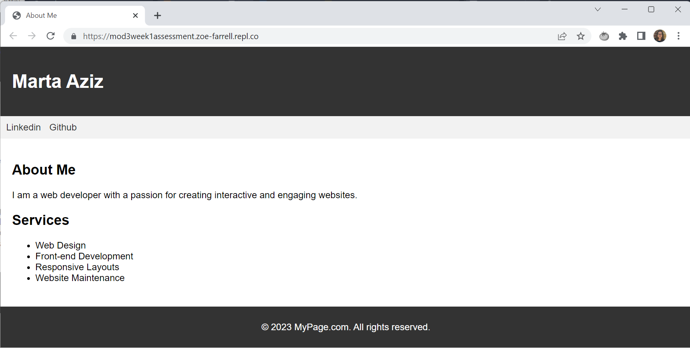

# Week 1 Assessment

### Setup
* Fork this repository
* You may make edits directly in github
* For the Exercise section, you will want to be logged in to [replit](https://replit.com)

## Questions (10 Points)

1. Define HTTP and why it's important.

2. Using [Google Drawings](https://docs.google.com/drawings) Create a diagram of the request and response cycle when a user visits turing.edu. Include clear labels for all components. Put the link to your drawing below. (3 points possible)

3. Describe two parts of every HTTP request.

4. How do you describe the difference between HTML and CSS? use an analogy or an example in your answer.

5. How can the chrome dev tools help with writing html and css?

6. How do you open the chrome dev tools?

7. Why is it important to use semantic HTML tags?

8. What are the three components of the box model?

## Exercise (10 Points)

* Create a new HTML/CSS/JS replit
* Using HTML and CSS, replicate as closely as possible the site shown below
* You must demonstrate the following:
  * Two types of header tags
  * A list
  * A semantic html element
  * A Link
  * A paragraph tag
  * A title
  * Changing the background color of an element
  * Targeting an element in css using an id
  * Targeting an element in css using the html tag
  * Adding margin or padding to an element
* When finished, add a link to your Replit here: <A link to your repl here>

### Submission
* Submit a link to your forked repository in the Submission form provided in your slack channel.

## Rubric
This assessment has a total of 20 points.  Scoring 15 or higher is considered a pass.
